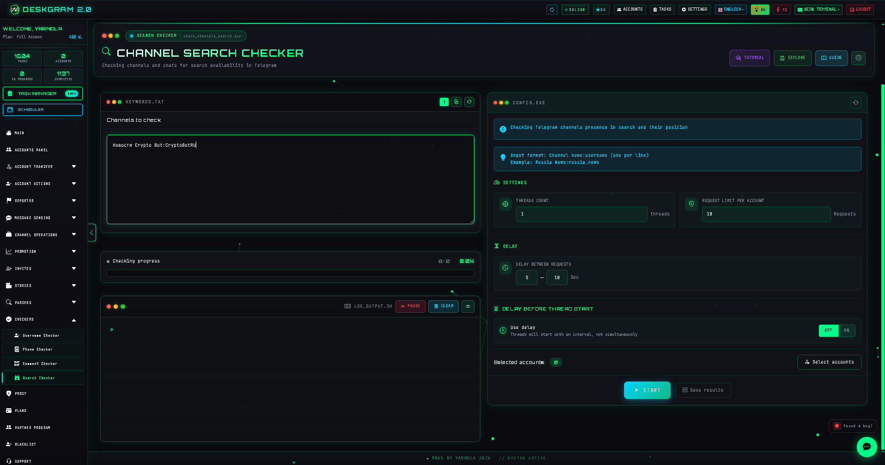
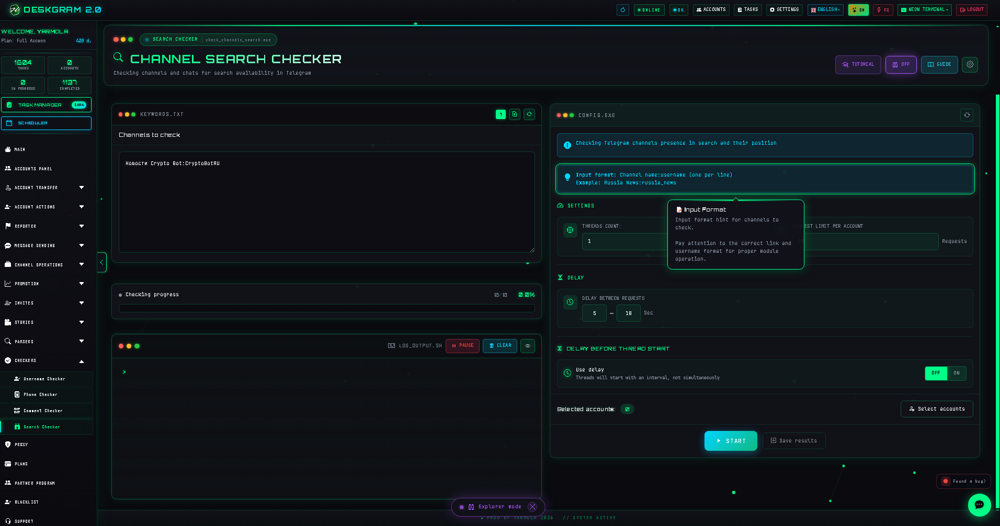
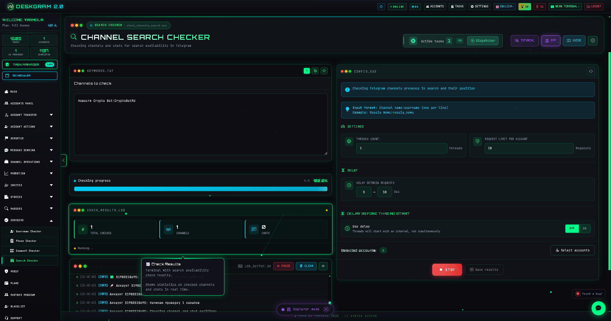
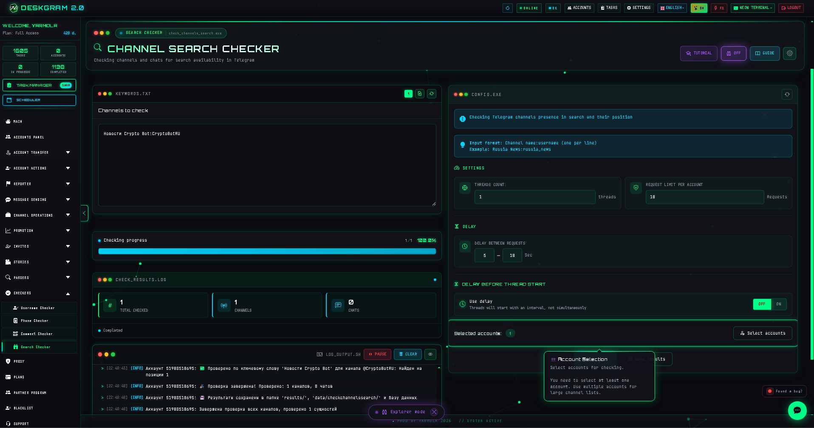

# Telegram Search Ranking Checker with Deskgram 2

Telegram Search Ranking Checker in Deskgram 2 helps check whether channels and chats appear in Telegram search before you move into discovery, comparison, or expansion routes. The module is useful when you want to validate visibility instead of assuming a channel is easy to find.

[Deskgram 2 Hub](https://github.com/Deskgram-2/deskgram-2-telegram-automation-en) · [Website](https://deskgram2.com/) · [Telegram Bot](https://t.me/DG2welcomebot) · [Web Preview](https://deskgram2.com/web-preview?path=%2Fapp-demo%2F&lang=en)

## Interactive Web Preview

Try the module interface in the browser: [Open web preview](https://deskgram2.com/web-preview?path=%2Fapp-demo%2Ffunctions%2Fcheck_channels_search&lang=en)

This is a quick way to inspect search formats, stats, and account assignment before the visibility check starts.

## Screenshots

## About the module

| Parameter | What is inside |
|---|---|
| Main task | Checking search visibility of Telegram channels and chats |
| Important blocks | Main list, format options, statistics, account selector |
| Useful for | Discovery validation, niche comparison, visibility checks |
| Related sections | Channel Search, Similar Channels, Comments Checker |

## What it can do

- check whether channels and chats appear in Telegram search;
- compare result visibility before the next discovery route;
- help validate lists before parser or engagement work begins;
- keep search statistics visible during the run;
- reduce guesswork around channel visibility.

## Quick start

1. Prepare the channel, chat, or keyword list.
2. Configure the search format and checker settings.
3. Select the accounts you want to use.
4. Run the visibility check and review the result summary.
5. Reuse the validated list in the next discovery or execution layer.

## Where this module fits best

- [Channel Search](https://github.com/Deskgram-2/telegram-channel-search-deskgram-en), if the next step is expanding the discovery route with search-ready candidates;
- [Similar Channels](https://github.com/Deskgram-2/telegram-similar-channels-deskgram-en), if you want to compare search-visible sources against neighboring communities;
- [Channel Comments Checker](https://github.com/Deskgram-2/telegram-channel-comments-checker-deskgram-en), if the next layer depends on open comments;
- [Task Manager](https://github.com/Deskgram-2/telegram-task-manager-deskgram-en), if the check should stay inside a larger operating stack.

## When it is especially useful

- when channel visibility in Telegram search matters before the next route;
- when discovery should start from search-validated lists;
- when you need a cleaner comparison of channels or chats in the search layer;
- when parser or engagement work should avoid weak visibility targets.

## What to choose: search ranking checker or channel search

| If your goal is | Better fit |
|---|---|
| Validate whether channels appear in Telegram search | `Search Ranking Checker` |
| Find new channels by keyword from scratch | [Channel Search](https://github.com/Deskgram-2/telegram-channel-search-deskgram-en) |
| Compare visibility before acting on a list | `Search Ranking Checker` |
| Expand a niche map outward | `Channel Search` |

## Related repositories

- [Deskgram 2 Hub](https://github.com/Deskgram-2/deskgram-2-telegram-automation-en)
- [Channel Search](https://github.com/Deskgram-2/telegram-channel-search-deskgram-en)
- [Similar Channels](https://github.com/Deskgram-2/telegram-similar-channels-deskgram-en)
- [Channel Comments Checker](https://github.com/Deskgram-2/telegram-channel-comments-checker-deskgram-en)
- [Task Manager](https://github.com/Deskgram-2/telegram-task-manager-deskgram-en)

## FAQ

### Can I inspect the module before installing anything?

Yes. The web preview shows the search visibility layout, format settings, statistics, and account selector before setup.

### Is this the same as keyword search for new channels?

No. This module is stronger when you need to validate visibility of a prepared list, while Channel Search is better for discovering new candidates from scratch.
